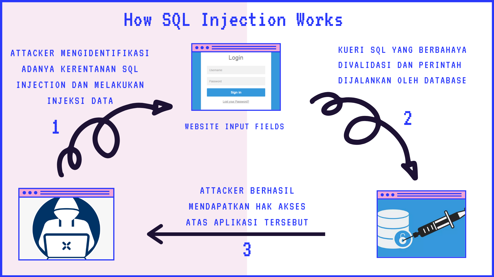

# Injection

Kerentanan injeksi, seperti injeksi SQL, NoSQL, OS dan LDAP, terjadi ketika data yang tidak terpercaya dikirim ke penerjemah sebagai bagian dari perintah atau kueri. Data tersebut dapat membuat aplikasi menjalankan perintah yang tidak diinginkan atau mengakses data tanpa otorisasi yang tepat. Pada kali ini, akan dijelaskan mengenai kerentanan SQL Injection yang ada pada sebuah aplikasi.

## Gambar ilustrasi serangan 
## Kode rentan yang dapat menyebabkan SQL Injection adalah sebagai berikut : 
Jika menggunakan kode tersebut, dapat menyebabkan attcker melakukan injeksi kode kedalam kueri SQL. 
``` java
String query = "SELECT account balance FROM user_data WHERE user_name = "
+ request.getParameter("customerName");

try {
    Statement statement = connection.createStatement( ... );
    ResultSet results = statement.executeQuery( query );
}
```
## Cara melakukan eksploit SQL Injection pada sebuah aplikasi dapat digambarkan dari scenario dibawah ini seperti berikut : 
    Scenario #1 : 
        Tautology Based Attack : 
        Tujuan dari tautology based attack adalah untuk menginjeksi kode pada satu atau lebih baris perintah SQL dengan kondisi bersyarat sehingga baris perintah tersebut akan selalu dieksekusi dengan nilai benar atau true. 

        Terdapat sebuah login form pada sebuah aplikasi, seorang attacker ingin melakukan bypass terhadap mekanisme otentikasi yang ada pada aplikasi tersebut. Untuk dapat melakukan bypass, attacker mengisi form login seperti berikut : 

        attacker menuliskan field username dengan admin' or '1'='1'--
        sedangkan untuk password diisi oleh attacker secara sembarang. Setelah attacker menekan tombol login, attacker akan berhasil melakukan bypass pada aplikasi tersebut.
    

## Mitigasi yang dapat dilakukan untuk menghindari adanya serangan SQL Injection adalah sebagai berikut: 
    1. Menggunakan Parameterized SQL Query atau prepared statement. 
    2. Melakukan Pengecekan Pola (Pattern Check): Validasi input data
    3. Menambahkan Escape Karakter
    4. Menonaktifkan informasi pesan kesalahan aplikasi (error)
    

## Alasan mengapa mitigasi itu berhasil dilakukan dan proses mitigasi nya bagaimana
1. Penggunaan parameterized query ditujukan agar database  dapat membedakan mana yang merupakan SQL statement dan  mana yang merupakan data yang diinputkan oleh pengguna.  

``` php
if (!($stmt = $mysqli->prepare("INSERT INTO test(id) VALUES (?)"))) {
    echo "Prepare failed:(" . $mysqli->errno .") " . $mysqli->error;
}
```
2. Dapat melakukan validasi input dengan menolak input data yang memang benar-benar diketahui tidak baik seperti berikut : [(' OR)] | ('(''|[^'])*')|(;)|((ALTER|CREATE|DELETE|DROP|EXECUTE){0,1}|INSERT(+INTO){0,1}|MERGE|SELECT|UPDATE|UNION(+ALL){0,1})}]

3. Untuk menghindari kesalahan eksekusi dalam database, tambahkan karakter escape seperti back slash, misal  (\’).  Sehingga karakter single quote akan tetap diartikan sebagai single quote oleh database. 
4. Untuk menghindari Sql Injection, maka non-aktifkan mode debug pada aplikasi untuk mencegah pesan error yang ditampilkan dimanfaatkan oleh pihak penyerang.

## Saran dalam membangun software untuk kasus tersebut (secure code nya)
1. Contoh kode menggunakan Prepared Statement untuk menghindari SQL Injection
```java
// This should REALLY be validated too
String custname = request.getParameter("customerName");
// Perform input validation to detect attacks
String query = "SELECT account_balance FROM user_data WHERE user_name = ? ";
PreparedStatement pstmt = connection.prepareStatement( query );
pstmt.setString( 1, custname);
ResultSet results = pstmt.executeQuery( );
```